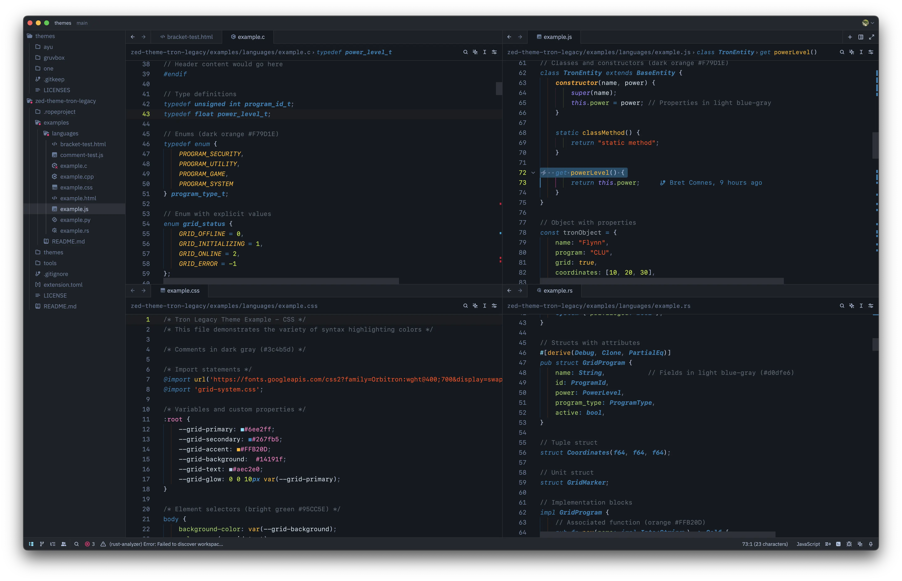
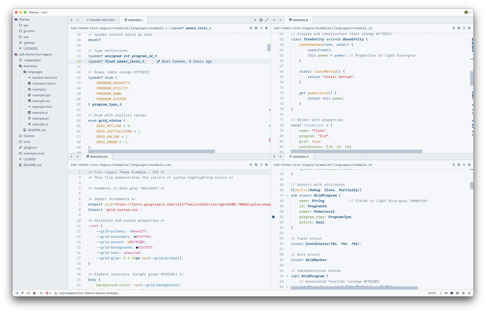

# Tron Legacy Theme for Zed

A port of the old Textmate theme "Tron Legacy" to Zed, with a new light mode.

## Features

- Dark blue background with cyan accents reminiscent of the Tron universe
- High contrast syntax highlighting optimized for readability
- Carefully selected colors that maintain WCAG contrast ratios
- Support for all Zed UI elements and syntax tokens

## See also

- [tron-legacy-vscode](https://github.com/bcomnes/tron-legacy-vscode)
- [sublime-tron-color-scheme](https://github.com/bcomnes/sublime-tron-color-scheme)

## License

MIT License - See [LICENSE](LICENSE) file for details
