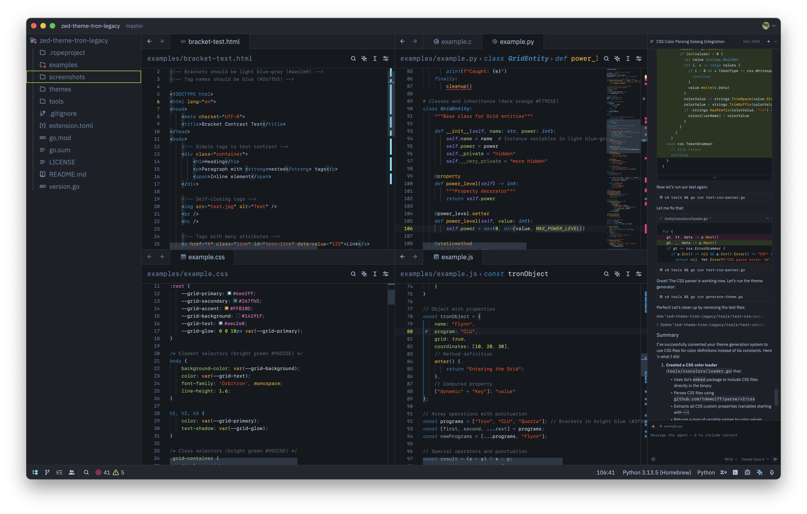
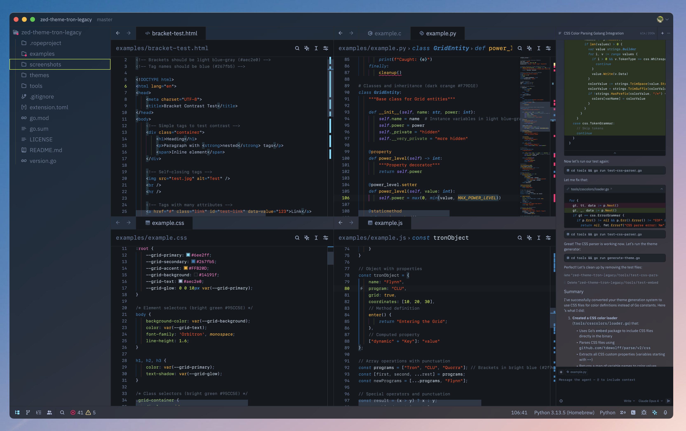
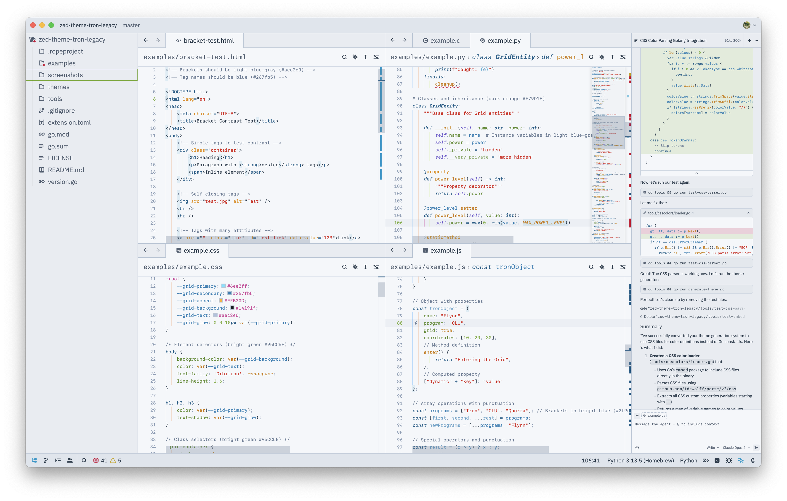
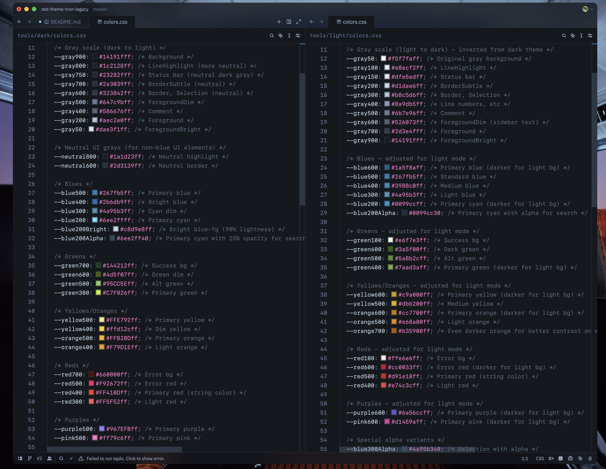

# Tron Legacy Theme for Zed

A port of the old Textmate theme "Tron Legacy" to Zed, with a new light mode and frosted variants.






## Features

- High contrast syntax highlighting optimized for readability
- Carefully selected colors that maintain WCAG contrast ratios
- Support for all Zed UI elements and syntax tokens
- Light and Dark variants
- Frosted transparent variants.

## Developing

To test and generate the theme run:

```console
make all
```

There are two color schemes: [`dark/colors.css`](./tools/dark/colors.css) and [`light/colors.css`](./tools/light/colors.css).
Both dark and light colors include frosted color variants.
The colors are defined in colors.css files as css variables so that zed can display in-line color previews.



The colors are loaded into [`palette.go`](./tools/dark/palette.go) and assigned to a semantic [`TronThemePalette`](./tools/palette/palette.go) mapping.
These semantic mappings are then fed into [`generator.go`](./tools/generator.go) and the final output ends up in [`themes/tron-legacy.json`](./themes/tron-legacy.json).

## See also

- [tron-legacy-vscode](https://github.com/bcomnes/tron-legacy-vscode)
- [sublime-tron-color-scheme](https://github.com/bcomnes/sublime-tron-color-scheme)
- [Tron.tmbundle](https://github.com/bcomnes/Tron.tmbundle) - The orginal

## Acknowledgments

Thank you Dayle Rees and Tim Heckman, the original creators of this fantastic theme. Thank you ColorSublime for helping put so many fantastic color schemes out into the world.

## License

MIT License - See [LICENSE](LICENSE) file for details
